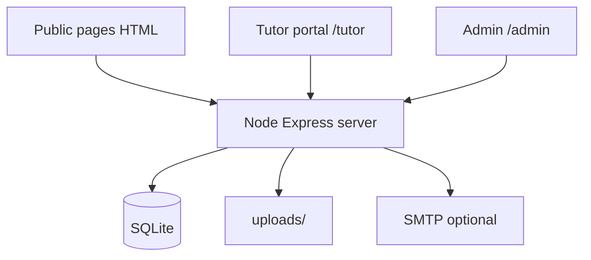

# Polygon Pedagogues

Multi-page tutoring site with working forms, private uploads, email alerts, an admin inbox, and a tutor attendance portal. Built for Polygon Pedagogues operations (referrals, parent enquiries, tutor applications, safeguarding pages).

Live (Render): https://polygon-pedagogs.onrender.com

## Features

- Referral, parent/carer, tutor application, and contact forms
- SQLite storage (`data/polygon.db`) and private `uploads/` (not public)
- Admin inbox: filter, status, download attachments
- Tutor portal: Present / Absent / Late, times, remarks
- Optional SMTP notifications (falls back to console logs)

## Architecture



## Quick start

```bash
cp .env.example .env
npm install
npm start
```

- Site: http://localhost:3000
- Admin: http://localhost:3000/admin/
- Tutor: http://localhost:3000/tutor/

Default admin (change before any real use): `admin` / `change-me-now`

## Tutor attendance flow

1. Admin creates tutors and students, then assigns them
2. Tutor signs in and marks attendance for a student
3. Same-day re-submit updates the existing record
4. Admin reviews under Attendance filters

## Scripts

- `npm start` - production-style server
- `npm run dev` - Node watch mode
- `npm run init-db` - create folders/tables

Do not commit `.env`, `data/`, or `uploads/`. Have a professional review safeguarding copy before a public launch.
